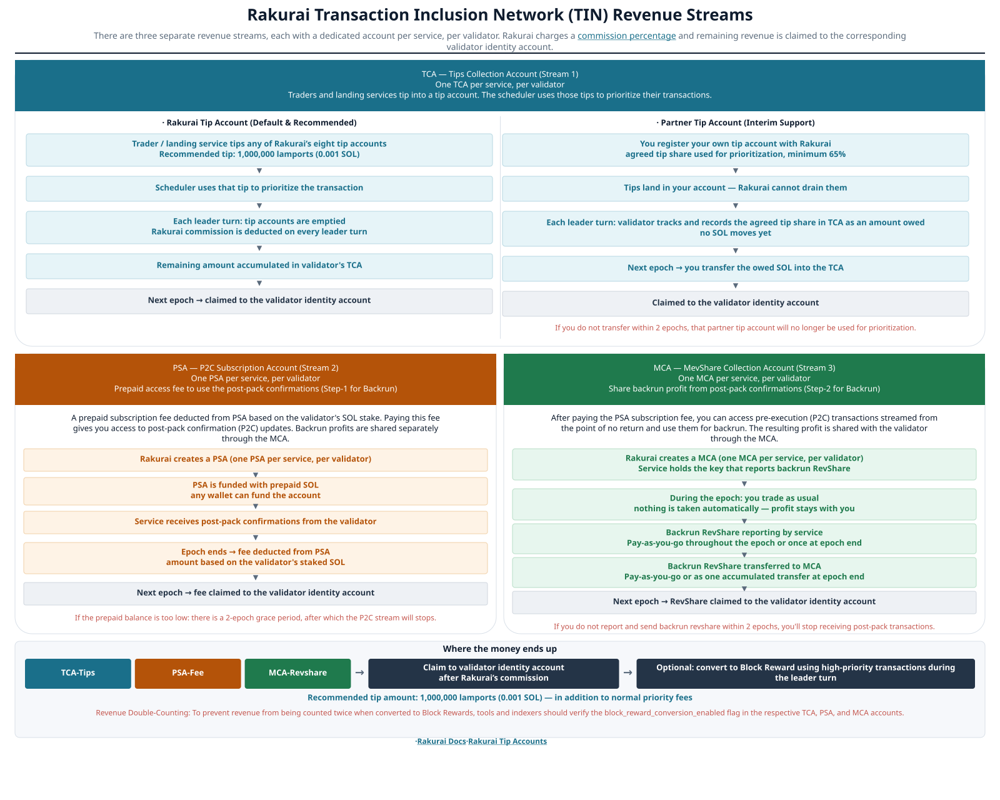

# TIN — Transaction Inclusion Network

Documentation for searchers, block engines, and partners integrating with Rakurai validators.

**Audience:** TIN partners, MEV searchers, and traders sending bundles or consuming post-pack confirmations.

---

## Quick start: get enabled on TIN

Follow these steps to onboard as a landing service / searcher / P2C user.

**Guides:** [Transaction inclusion](./transaction_inclusion.md) · [Post-pack confirmations](./post_pack_confirmations.md) · [Tips FAQ](./rakurai_tip_manager_faqs.md) · [PSA CLI](../rakurai_programs/cli/p2c_subscription.md) · [Settlement CLI](../rakurai_programs/cli/partner_reward_settlement.md)

### 1. Review the revenue flow

| Stream | Account | What it is | Docs |
|--------|---------|------------|------|
| Tips / landing priority | **TCA** | Tip into a tip account; scheduler uses it to prioritize | [Tips FAQ](./rakurai_tip_manager_faqs.md) · [TCA](../rakurai_programs/programs/reward_distribution/README.md#3-tca--tips-for-landing-transactions) · [Tip accounts](./rakurai_tip_manager_faqs.md#appendix-program-and-tip-account-addresses) |
| Post-pack access | **PSA** | Prepaid fee to receive P2C updates | [Post-pack confirmations — PSA](./post_pack_confirmations.md#2-psa--p2c-subscription-account) · [PSA CLI](../rakurai_programs/cli/p2c_subscription.md) |
| Backrun share | **MCA** | Report and settle MEV-share / backrun profit | [Post-pack confirmations — MCA](./post_pack_confirmations.md#3-mca--share-backrun-profit) · [Settlement CLI](../rakurai_programs/cli/partner_reward_settlement.md) |

Full program overview: [Reward Distribution](../rakurai_programs/programs/reward_distribution/README.md).

### 2. Ready / setup the required gRPC services

Validators **do not open a listen port for you**. Each validator **connects outbound to your servers**. You run the gRPC servers and make them reachable.

| Path | What you provide | What the validator does |
|------|------------------|-------------------------|
| **Block engine (bundles)** | A **global / discovery** endpoint (`GetBlockEngineEndpoints`) that returns your `block_engine_url`(s) | Connects automatically to the **lowest-latency** endpoint |
| **P2C (post-pack)** | The **URL** your Relayer gRPC server listens on | Connects directly to that URL for `StartExpiringPacketStream` |

| Path | Role | Services |
|------|------|----------|
| **Bundles** | `VALIDATOR` | `auth.AuthService` + `block_engine.BlockEngineValidator` (`SubscribePackets` / `SubscribeBundles`) |
| **P2C** | `RELAYER` | `auth.AuthService` + `block_engine.BlockEngineRelayer` (`StartExpiringPacketStream`) |

- Discovery response shape: [GetBlockEngineEndpoints](./transaction_inclusion.md#11-endpoint-getblockengineendpoints)
- Full gRPC requirements: [Required gRPC services](./transaction_inclusion.md#13-setup-required-grpc-services)
- P2C packet / auth details: [Post-pack — setup gRPC](./post_pack_confirmations.md#41-setup-required-grpc-services)
- Protos: [`auth.proto`](../../jito-protos/protos/auth.proto), [`block_engine.proto`](../../jito-protos/protos/block_engine.proto), [`packet.proto`](../../jito-protos/protos/packet.proto)

One URL can serve both paths only if it exposes **Validator and Relayer** auth/APIs; otherwise use separate URLs.

### 3. Contact Rakurai and share your wallet pubkey

On [Discord](https://discord.gg/XS7GmnmCJg) or [Telegram](https://t.me/rakurai_official), share:

1. Your **block-engine discovery / global URL**, and your **P2C URL** (if different)
2. A **wallet pubkey you control** (you hold the private key) — used for **PSA / MCA** recording and settlement

Rakurai registers endpoints and creates per-validator PSA / MCA (and tip / TCA wiring as needed). Keep that key secure for epoch settlement ([`rakurai-revshare`](../rakurai_programs/cli/partner_reward_settlement.md)).

### 4. Tip, fund PSA, and go live

| Action | What to do |
|--------|------------|
| **Tip (recommended)** | Transfer **1,000,000 lamports (0.001 SOL)** to a [Rakurai tip account](./rakurai_tip_manager_faqs.md#appendix-program-and-tip-account-addresses) in each tipped tx / bundle — **in addition to** priority fees ([Virtual priority](./transaction_inclusion.md#2-virtual-priority-boost)) |
| **Fund PSA** | Top up with [`rakurai-p2c`](../rakurai_programs/cli/p2c_subscription.md) after PSA exists ([PSA guide](./post_pack_confirmations.md#2-psa--p2c-subscription-account)) |
| **Send traffic** | Bundles via block engine; P2C backruns from streamed packets + tip ([Bundle requirements](./transaction_inclusion.md#32-bundle-requirements)) |
| **Settle each epoch** | MCA (and custom-tip TCA if used) via [`rakurai-revshare`](../rakurai_programs/cli/partner_reward_settlement.md) |

**Recommended tip:** **1,000,000 lamports (0.001 SOL)** to a [Rakurai tip account](./rakurai_tip_manager_faqs.md#appendix-program-and-tip-account-addresses) for landing / virtual priority.

---

## 2. Note: do not double-count tips and converted block rewards

External indexers that watch **transfers into Rakurai tip accounts** and also watch **validator block rewards** can count the **same SOL twice**.

What happens on-chain:

1. A **tip** (TCA), **PSA** fee, or **MCA** share is claimed to the validator identity.
2. If **`block_reward_conversion_enabled`** is set on that **TCA / PSA / MCA** account (this flag is **on by default**), the claimed amount is sent again as a **high-priority block-reward** transaction during a leader turn.

That block-reward transaction is the **converted claim**, not new revenue. If you already counted the tip (or the PSA/MCA payout), counting the later block reward as extra income is double counting.

**How to avoid it**

- Read `block_reward_conversion_enabled` on the **TCA**, **PSA**, and **MCA** accounts (see [Reward Distribution — block-reward conversion](../rakurai_programs/programs/reward_distribution/README.md#block-reward-conversion-for-tcamcapsa-revenue)).
- If the flag is **on**, count the money **once**: either at the tip / claim, or as the converted block reward — not both.

The conversion transaction must land in **that leader turn** or it is dropped (it is not forwarded to the next leader).
